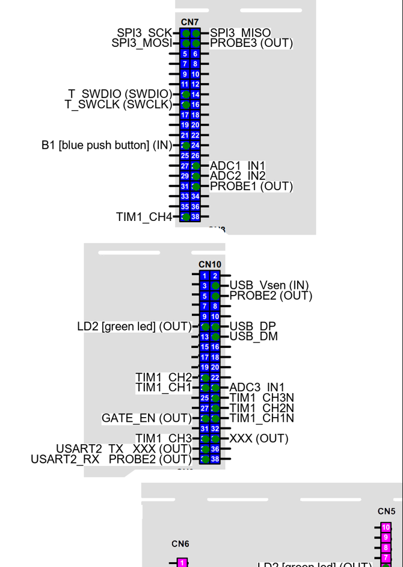

<h1>stm32_nucleo_pinout</h1>

- [Description](#description)
- [Getting Started](#getting-started)
- [HOW TOs](#how-tos)
- [References](#references)
- [Naming convention](#naming-convention)
- [TODO](#todo)


# Description

A package to generate pinout images for STM32 Nucleo boards, based on STM32CubeIDE/STM32CubeMX report file

Example of output image:




# Getting Started

With STM32CubeMX (or STM32CubeIDE), generate a report file (File -> Generate Report)

Then run the script with the report file as input (the txt, not the pdf):

```bash
stm32_nucleo_pinout path_to_report/my_report.txt
stm32_nucleo_pinout -h
```


# HOW TOs

- [How to create a new board](docs/how_to_create_new_board.md)
- [How to create a template](docs/how_to_create_template.md)


# References

[UM1724 MB1136 DB1724 STM32 Nucleo-64 boards](https://www.st.com/resource/en/user_manual/um1724-stm32-nucleo64-boards-mb1136-stmicroelectronics.pdf)
[UM1974 MB1137 DB3171 STM32 Nucleo-144 boards](https://www.st.com/resource/en/user_manual/um1974-stm32-nucleo144-boards-mb1137-stmicroelectronics.pdf)


# Naming convention

- connector CN7
- pin_number  5
- connector_key  CN7_5
- pin_name  PA5


# TODO

- footnotes not implemented yet
- generate pdf instead of a big image
