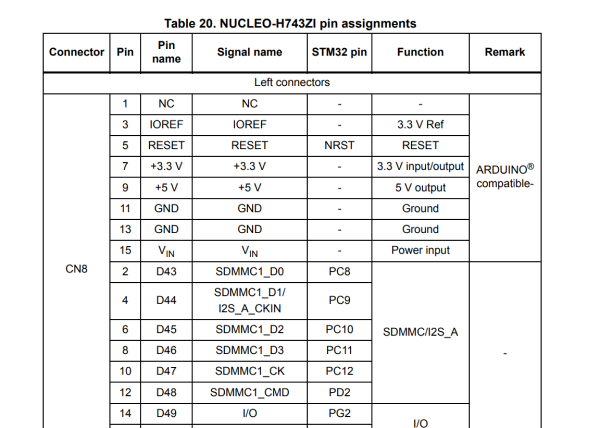
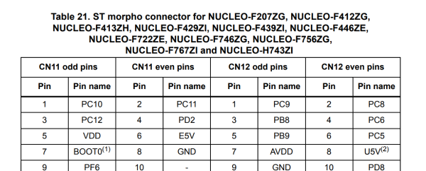

IMPORTANT: If another board with compatible pinout is already supported, just include the association the boards/boards.json. The board name must match the MCU value that the STM32CubeIDE report file will have.

In templates/templates.json add a new entry with the board code and its associated template.

The information about the pins is obtained from the datasheet of the board.

Ej.
- [UM1724 MB1136 DB1724 STM32 Nucleo-64 boards](https://www.st.com/resource/en/user_manual/um1724-stm32-nucleo64-boards-mb1136-stmicroelectronics.pdf)
- [UM1974 MB1137 DB3171 STM32 Nucleo-144 boards](https://www.st.com/resource/en/user_manual/um1974-stm32-nucleo144-boards-mb1137-stmicroelectronics.pdf)

There are several parsers depending of how the information is presented. I found more convenient to convert the pdf to odt using libreoffice, and copy paste the tables as tab separated values (.tsv)



For this kind of tables, create an individual file for each connector, like CN5.tsv, copy the following columns (use microsoft word or openoffice) like this:

```tsv
Pin	Pin name	Signal name	STM32 pin	Function
25	D67	CAN_RX	PD0	CAN_1
27	D66	CAN_TX	PD1	
29	D65	I/O	PG0	I/O
```

only "Pin", "Pin name" and "STM32 pin" are required and the labels must match exactly. The other columns will be ignored.
Sometimes after the copy/paste some minor modifications are required, like removing blank lines. This can be done with word/openoffice, or I found more convenient the vscode extension "Edit csv".

For the morpho connector



The labels must be manually added in this format (O odd, E even):

```tsv 
CN7_O_pin	CN7_O_name	CN7_E_pin	CN7_E_name	CN10_O_pin	CN10_O_name	CN10_E_pin	CN10_E_name
```

WARNING: in some datasheets the order is pin name pin name, in other is pin name name pin

Copy/paste the footnotes of both arduino and morpho sections to arduino_footnotes.txt and morpho_footnotes.txt. Keep the format as in the datasheet: "1. description" some special characters can be replace.

Generate the `pinout.json` file using the following command:

``` python stm32_nucleo_pinout/generate_pinout.py UM2407 ```

Check the generated file with the following command:

``` python stm32_nucleo_pinout/check_board.py UM2407 ```

in boards/<board>/info.txt add the following information:
- Document where the information was obtained from, including the version
- Tables where the information was copied from
- Other compatible boards for this pattern

in boards/boards.json include all the mucleo models that will use this pattern
