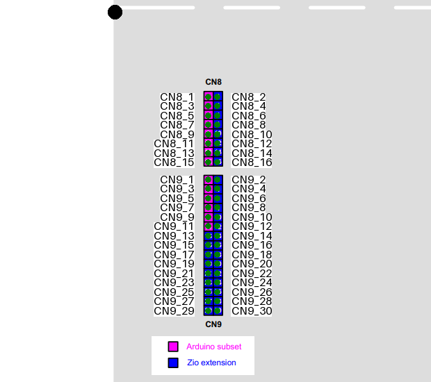

create a folder inside templates
Add images for each group of connectors
Include a info.json (use another as reference)
The data is grouped by the images, for each image there is some common data like the origin (from where the rest of the coordinates are referenced), and then a list of connectors.
Check each image with:

```bash
# python check_template.py <template> <image>
python stm32_nucleo_pinout/check_template.py nucleo64 morpho_right.png -c
```

the -c option allows to click on the image to get the coordinates of the click
The black dot represent the origin
The y_spacing can be negative when the pin numbers are reversed, for example nucleo64 connector CN5


